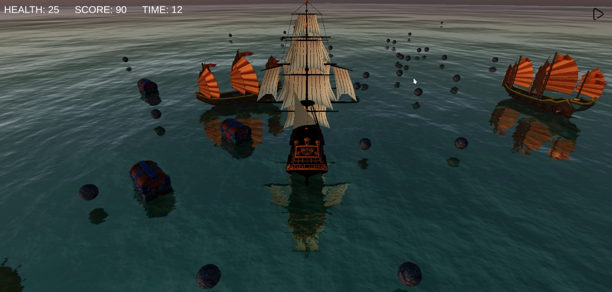
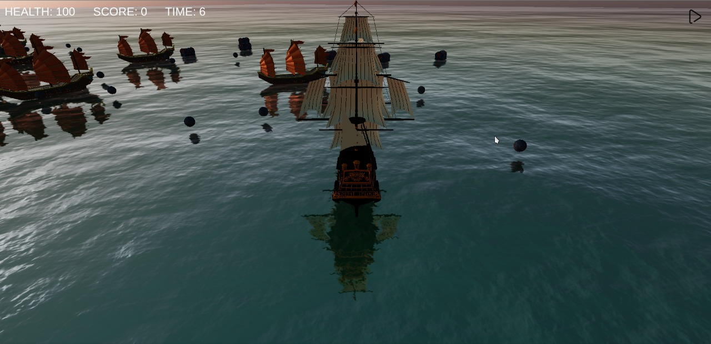
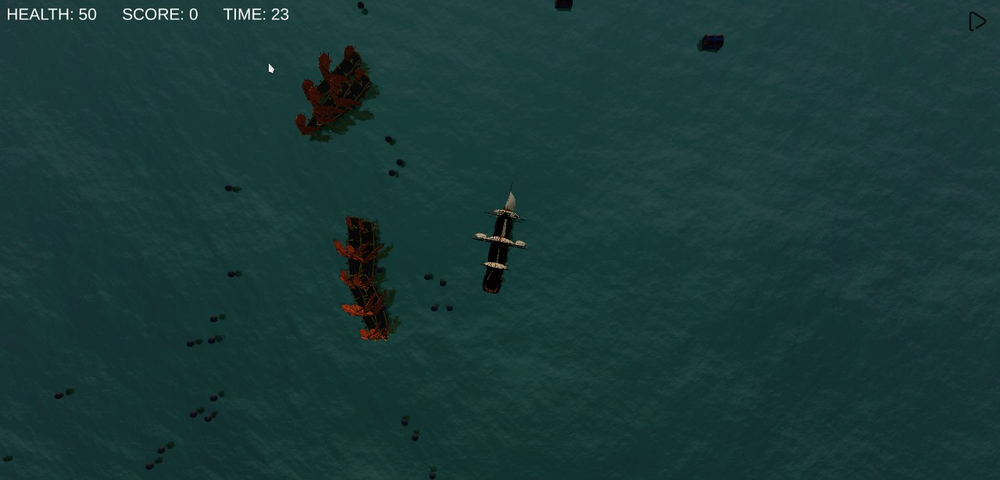
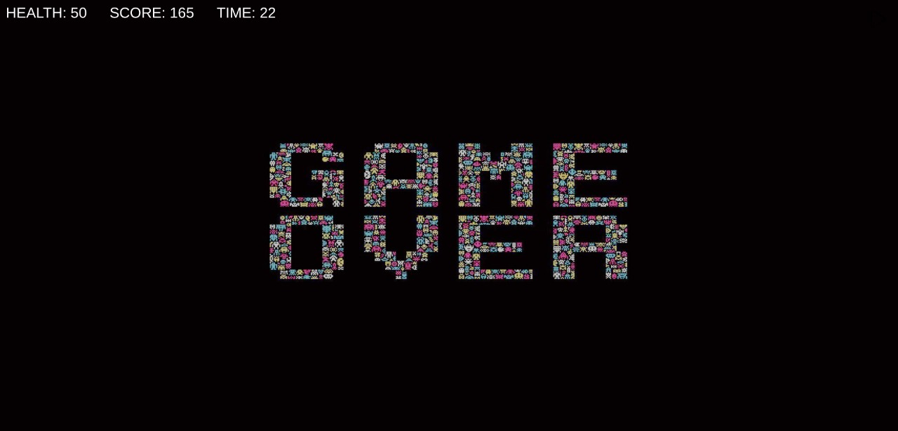

# OASIS
A 3D Pirate Battle Ship game built using WebGL and Three JS. The main goal of this game is to destroy all the enemy ships and collect treasure chests. 
## Player
The player can move freely in any direction and can even rotate around its own axis. Use `W,A,S,D` to control movement of the player and use `Left, Right` arrow keys to control the rotation of the player.</br>
The player can also shoot canons with a cooldown period. To make it look realistic, they player ship shoots canons from its side, instead of front. The canons on direct hit with enemy ships, destroy them. To shoot canons press `Space`</br>
Player has start health of `100` and after every hit with enemy or enemy canon ball, its health reduces a bit.</br>
Lastly, Score of the player increases when we destroy an enemy ship or collect a treasure chest.
## Enemy
The enemy spawns at random positions and they slowly approach the player (but at random speeds). Enemy ships shoot canon at player after a particular interval and cause damage to player ship on direct hit.</br>
On direct hit with player or player canon ball, the enemy ship gets destroyed.
## Game over Screen
When player health becomes 0 or player destroyes all enemy ships, a `game over` screen is rendered.

## How to play the game
* go to the game directory `oasis` and perform the following commands on terminal
```
$ npm run dev
```
* now open `http://localhost:3000/` in your internet browser and enjoy the game :)

## Images






